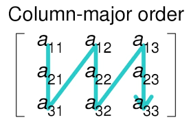
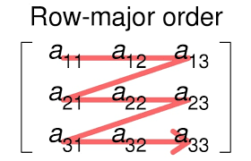

## 25 Row e Column Major Order

# Layout de Dados: Row-and-Column-Major Order

- São Estratégias para armazenar arrays multidimensionais de forma linear na Memória RAM que a linguagem de programação utiliza

- As linguagem de programação podem usar layouts de dados diferentes e sabe como cada uma trabalha permite a comunicação entre linguagens de maneira mais eficiente
  - C e C++ utilizam o layout Row-Major Order
    - Este layout lê os dados assim como os principais cache de memória, o que a destaca com relação as demais
  - Fortram, Matlab e R são exemplos de linguagem que utilizam o layout Column-Major Order
    - Apesar desta abordagem ter como benefício a maior eficiencia em cálculos matriciais, como desvantagem ela possui maior inecifiencia no uso do cache do processador, o que resulta em um algoritmo menos lento que em layouts Row-Major order
- O por que disso acontecer

  - Antes de tudo é importante entender como o cache do processador funciona. De forma geral:
    - Quando o processador precisa de uma determinada variável para efetuar um cálculo ele **procura na memória cache**
    - Quando ele não a encontra no cache ele **pega da memória RAM e guarda no cache**, mas não só isso, como ele sabe que possivelmente as próximas variáveis também serão usadas e o custo de ir na RAM, procurar a variável e gravar no cache é alto, o sistema pega uma certa quantidade de dados e gravata tudo de uma vez
    - O **sistema pega os dados sequêncialmente**, a partir da variável que ele foi buscar inicialemente.
  - Por conta do sistema pegar os dados sequêncialmente, layouts que manipulam os dados de maneira sequêncial, são mais eficientes

    - 
    - 

    Como pode ser visto na imagem **Column-Major Order**, a leitura vai do _a11_ para o _a21_, o problema é que o cache copia da ram as variáveis na sequência que são _a12_ e _a13_, supondo que o cache copia somente 3 variáveis por vez.

    - ciclo 1
      - O processador pede pela a11
      - O sistema não encontra em cache
      - Sistema limpa o cache
      - Vai na ram e copia na cache a11, a12 e a13
    - ciclo 2
      - O processador pede pela a21
      - O sistema não encontra em cache, pois só tem a a11, a12 e a13 salva
      - Sistema limpa o cache
      - Vai na ram e copia na cache 021, a22 e a23
    - **Isso se repete até a leitura completa da matriz**

  - Como pode ser visto no exemplo, toda vez que o processador precisa de uma nova variável, ele não a encontra no cache, pois o cache salva sequêncialmente, enquanto o layout Column-Major Order processa pela coluna.

  - Se fizermos um exemplo considerando o mesmo cache que salva apenas 3 dadoos por vez, mas usando o layout Row-Major Order, temos o seguinte
  - ciclo 1 - O processador pede pela a11 - O sistema não encontra em cache - Sistema limpa o cache - Vai na ram e copia na cache a11, a12 e a13
    - ciclo 2
      - O processador pede pela a12
      - O cache já possui a a12
      - Processador usa a a12
        - O processador pede pela a13
        - O cache já possui a a13
        - Processador usa a a13
          - O processador pede pela a14
          - O sistema não encontra em cache
          - Sistema limpa o cache
          - Vai na ram e copia na cache a14, a15 e a16
          - **Isso se repete até a leitura completa da matriz**

- Como pôde ser visto o sistema trabalha bem menos usando o Row-Major Order pois este layout funciona de acordo com a gravação natural do cache
