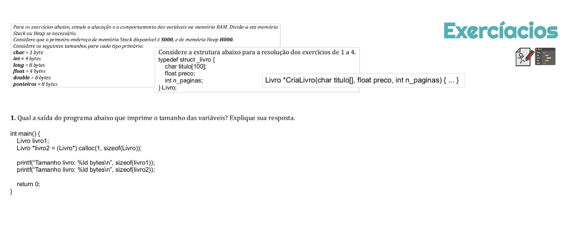
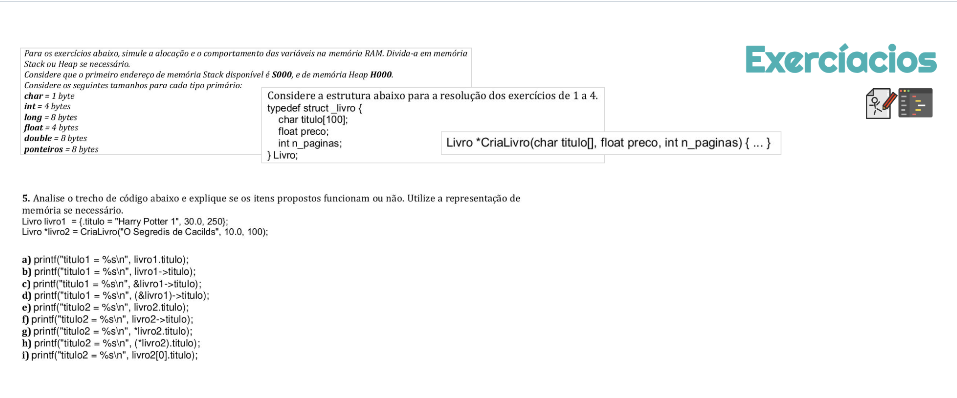

## 31 Structs: Exercícios



**Resposta:**
sizeof(livro1) = 108 bytes;
sizeof(livro2) = 8 bytes;

```c
  #include <stdio.h>
  #include <stdlib.h>
  #include <string.h>

  typedef struct _livro {
    char nome[100];
    float preco;
    int n_paginas;
  } Livro;

  Livro* criarLivro(char nome[], float preco, int n_paginas) {
    Livro* livro = calloc(1, sizeof(Livro));
    strcpy(livro->nome, nome);
    livro->preco = preco;
    livro->n_paginas = n_paginas;
    return livro;
  }

  int main() {
    Livro livro1;
    Livro* livro2 = criarLivro("1942", 10, 300);

    printf("tamanho livro1: %ld \n", sizeof(livro1));
    printf("tamanho livro2: %ld \n", sizeof(livro2));
    printf("tamanho *livro2: %ld \n", sizeof(*livro2));
    return 0;
  }
  // tamanho livro1: 108
  // tamanho livro2: 8
  // tamanho *livro2: 108
```



**Resposta:**
a) certo
b) errado
c) errado
d) certo
e) errado
f) certo
g) errado
h) certo
i) certo

```c
  #include <stdio.h>
  #include <stdlib.h>
  #include <string.h>

  typedef struct _livro {
    char titulo[100];
    float preco;
    int n_paginas;
  } Livro;

  Livro* criarLivro(char titulo[], float preco, int n_paginas) {
    Livro* livro = calloc(1, sizeof(Livro));
    strcpy(livro->titulo, titulo);
    livro->preco = preco;
    livro->n_paginas = n_paginas;
    return livro;
  }

  int main() {
    Livro livro1 = {.titulo = "Harry Potter 1", 30.0, 250};
    Livro *livro2 = criarLivro("O Segredis de Cacilds", 10.0, 100);

    printf("titulo1 = %s\n", livro1.titulo);
    // printf("titulo1 = %s\n", livro1->titulo);
    // printf("titulo1 = %s\n", &livro1->titulo);
    printf("titulo1 = %s\n", (&livro1)->titulo);
    // printf("titulo2 = %s\n", livro2.titulo);
    printf("titulo2 = %s\n", livro2->titulo);
    // printf("titulo2 = %s\n", *livro2.titulo);
    printf("titulo2 = %s\n", (*livro2).titulo);
    printf("titulo2 = %s\n", livro2[0].titulo);

    return 0;
  }
```
